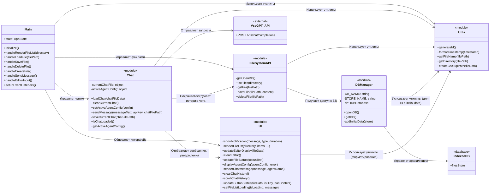

Проверка

# Описание работы на 14.04.2025, 23:59

**Общая концепция:**
Это веб-приложение, работающее полностью в браузере и использующее IndexedDB для создания виртуальной файловой системы. В ней хранятся чаты с ИИ-агентом (`/chats/`), конфигурации агентов (`/agents/`), секреты (API-ключи в `/secrets/`), код самого приложения (`/js/`) и другие пользовательские файлы.

**Основные компоненты и их взаимодействие:**

1.  **`index.html` (Структура):** Определяет интерфейс с файловым менеджером, областью чата, редактором/просмотрщиком файлов и кнопками действий.
2.  **`js/main.js` (Оркестратор):** Инициализирует приложение, управляет состоянием (текущая папка, выбранный файл), обрабатывает события пользователя и координирует работу других модулей (`FileSystemAPI`, `UI`, `Chat`, `Utils`).
3.  **`js/FileSystemAPI.js` (Виртуальная ФС):** Предоставляет API для работы с файлами и папками в IndexedDB, включая резервное копирование при удалении.
4.  **`js/UI.js` (Интерфейс):** Отвечает за все визуальные обновления на странице (список файлов, редактор, уведомления, чат).
5.  **`js/Chat.js` (Логика Чата):** Управляет загрузкой/сохранением истории чата, хранит конфигурацию агента, отправляет запросы к внешнему API (VseGPT) и обрабатывает ответы.
6.  **`js/Utils.js` (Утилиты):** Содержит вспомогательные функции.

**Ключевые процессы:**

*   **Загрузка:** При старте `main.js` инициализирует БД, копирует JS-файлы приложения в виртуальную ФС (`/js/`) и отображает корневую папку.
*   **Выбор файла:** `main.js` через `FileSystemAPI` читает файл, определяет его тип (чат, конфиг, код, другое) и обновляет `UI` и `Chat` соответственно.
*   **Отправка сообщения:** `main.js` проверяет/создает файл чата, получает API-ключ (из `/secrets/`), проверяет конфиг агента и вызывает `Chat.js` для отправки запроса и обновления чата.
*   **Редактирование кода:** `main.js` позволяет редактировать файлы из `/js/`, сохраняет их в IndexedDB и инициирует скачивание измененного файла, предлагая пользователю вручную заменить оригинал и перезагрузить страницу.

**Предполагаемые цели:**

1.  **Гибкое взаимодействие с ИИ:** Удобный интерфейс для чатов с разными конфигурациями агентов.
2.  **Локальное хранение:** Сохранение всех данных в браузере пользователя (IndexedDB).
3.  **Управление файлами:** Базовые операции с файлами в виртуальной системе.
4.  **Безопасность:** Хранение API-ключей отдельно в `/secrets/`.
5.  **Самомодификация:** Возможность редактировать код приложения "на лету" (экспериментально).
6.  **Модульность:** Структурированный код для удобства поддержки.

Это описание основано на анализе всех JS-модулей.

---

## Схема взаимодействия компонентов

---

## Логика модулей

*   **`js/main.js` (Оркестратор):**
    *   Инициализирует приложение: открывает IndexedDB, загружает JS-код в виртуальную ФС (`/js/`), настраивает обработчики событий, отображает корневую директорию.
    *   Управляет состоянием: текущая директория, выбранный файл, флаг несохраненных изменений, последняя загруженная конфигурация агента.
    *   Обрабатывает действия пользователя: навигация по папкам, выбор файла, ввод в редакторе, нажатия кнопок (Сохранить, Удалить, Создать, Отправить, Перейти в корень).
    *   Координирует взаимодействие между `FileSystemAPI`, `UI` и `Chat`.
    *   Реализует логику загрузки/сохранения/удаления/создания файлов, вызывая `FileSystemAPI`.
    *   Реализует логику отображения файлов и чатов, вызывая `UI` и `Chat`.
    *   Управляет процессом отправки сообщений, включая автосоздание чата и работу с API-ключами/конфигурациями агентов.
    *   Обрабатывает специфику редактирования JS-файлов (предлагает скачать и перезагрузить).
*   **`js/FileSystemAPI.js` (Виртуальная ФС):**
    *   Предоставляет асинхронный API для CRUD-операций (Create, Read, Update, Delete) с файлами и получения списка файлов/папок в IndexedDB.
    *   Использует `DBManager` для доступа к базе данных.
    *   Реализует логику резервного копирования: при сохранении измененного файла или удалении файла (кроме файлов в `/backup/`) создается копия в папке `/backup/` с временной меткой в имени.
    *   Использует `Utils` для работы с путями.
*   **`js/dbManager.js` (Менеджер БД):**
    *   Отвечает за открытие и управление соединением с IndexedDB (`smartAssistantDB_Modular`).
    *   При первой инициализации или обновлении версии создает хранилище объектов `files` с индексом по директории.
    *   Добавляет начальные файлы (примеры чата, агентов, секретов) при первом создании хранилища.
*   **`js/ui.js` (Интерфейс):**
    *   Содержит функции для манипуляции DOM-элементами и отображения данных пользователю.
    *   Рендерит список файлов/папок с поддержкой вложенности и динамической подгрузки (`renderFileList`).
    *   Обновляет редактор, информацию о файле, статус (`updateEditorDisplay`, `updateFileStatus`).
    *   Отображает уведомления (`showNotification`).
    *   Рендерит историю чата (`renderChatMessage`, `clearChatHistory`, `scrollChatHistory`).
    *   Отображает конфигурацию активного агента (`displayAgentConfig`).
    *   Управляет состоянием (активно/неактивно) кнопок действий (`updateButtonStates`) в зависимости от контекста (выбран ли файл, есть ли изменения, тип файла).
    *   Показывает индикаторы загрузки (`setFileListLoading`).
*   **`js/chat.js` (Логика Чата):**
    *   Управляет состоянием текущего открытого чата (`currentChatFile`) и активной конфигурации агента (`activeAgentConfig`).
    *   Загружает и парсит данные чата из файла (`loadChat`).
    *   Отправляет сообщения пользователя:
        *   Проверяет наличие API-ключа VseGPT (читает из `/secrets/api_keys.json` через `FileSystemAPI`). Если ключ отсутствует, запрашивает его у пользователя и сохраняет в `/secrets/api_keys.json`.
        *   Проверяет наличие активной конфигурации агента.
        *   Формирует историю сообщений для API.
        *   Отправляет запрос к API VseGPT (`https://api.vsegpt.ru/v1/chat/completions`).
        *   Обрабатывает ответ или ошибку.
        *   Добавляет сообщения пользователя и агента (или ошибку) в `currentChatFile.messages`.
        *   Вызывает `UI` для отображения сообщений.
        *   Вызывает `saveCurrentChat` для сохранения обновленной истории.
    *   Сохраняет текущую историю чата обратно в файл в IndexedDB (`saveCurrentChat`) через `FileSystemAPI`.
    *   Предоставляет функции для установки/получения активного агента и проверки, загружен ли чат.
*   **`js/utils.js` (Утилиты):**
    *   Набор вспомогательных статических методов: генерация ID, форматирование времени, извлечение имени/директории из пути, создание пути для бэкапа.

---

## Создание и открытие диалогов (чатов)

*   **Открытие существующего диалога:**
    1.  Пользователь кликает на файл `.json` в директории `/chats/` в списке файлов (`UI`).
    2.  `UI` вызывает колбэк `handleLoadFile` в `main.js`, передавая путь к файлу.
    3.  `main.js` проверяет, есть ли несохраненные изменения в редакторе, и запрашивает подтверждение, если есть.
    4.  `main.js` вызывает `FileSystemAPI.getFile(filePath)` для получения данных файла из IndexedDB.
    5.  `main.js` вызывает `UI.updateEditorDisplay`, чтобы показать JSON-содержимое файла в редакторе (хотя он не предназначен для прямого редактирования чата).
    6.  `main.js` вызывает `Chat.loadChat(fileData)`, передавая данные файла.
    7.  `Chat.loadChat` парсит JSON, сохраняет сообщения в `currentChatFile`, вызывает `UI.clearChatHistory` и затем `UI.renderChatMessage` для каждого сообщения, отображая историю в области чата.
    8.  `main.js` вызывает `UI.updateButtonStates`, чтобы настроить доступность кнопок (например, активировать кнопку "Отправить").
*   **Создание нового диалога (автоматически при отправке сообщения без выбранного чата):**
    1.  Пользователь вводит сообщение в редактор (`fileContentEditor`) и нажимает кнопку "Отправить сообщение" (`sendMessageButton`), при этом ни один файл чата в `/chats/` не выбран.
    2.  `UI` вызывает колбэк `handleSendMessage` в `main.js`.
    3.  `main.js` определяет, что файл чата не выбран (`isChatFileSelected` равно `false`).
    4.  `main.js` генерирует новое имя файла чата (например, `chat_YYYY-MM-DDTHH-MM-SS-mmmZ.json`) в директории `/chats/`.
    5.  `main.js` создает начальное содержимое для нового чата (пустой массив `messages`).
    6.  `main.js` вызывает `FileSystemAPI.saveFile(newChatFilePath, initialChatContent)` для сохранения нового файла в IndexedDB.
    7.  `main.js` (опционально) обновляет список файлов (`handleRenderFileList`), если текущая директория `/` или `/chats/`.
    8.  `main.js` вызывает `handleLoadFile(newChatFilePath)`, чтобы загрузить только что созданный чат (это обновит `state.selectedFilePath` и вызовет `Chat.loadChat`).
    9.  Теперь `state.selectedFilePath` указывает на новый чат, `isChatFileSelected` становится `true`.
    10. `main.js` продолжает выполнение `handleSendMessage`: получает API-ключ из `/secrets/` (или запрашивает), проверяет/устанавливает конфигурацию агента.
    11. `main.js` вызывает `Chat.sendMessage(messageText, apiKey, currentChatPath)`, передавая введенный текст, ключ и путь к новому файлу чата.
    12. `Chat.sendMessage` добавляет сообщение пользователя в `currentChatFile.messages`, отправляет запрос к API, добавляет ответ агента, вызывает `UI` для отображения и сохраняет обновленный файл чата через `saveCurrentChat`.
    13. `main.js` очищает редактор (`fileContentEditor`).
*   **Создание нового диалога (вручную через кнопку "Создать файл"):**
    1.  Пользователь находится в директории `/chats/` (или другой, но создает файл с `.json` в имени).
    2.  Пользователь нажимает кнопку "Создать файл".
    3.  `main.js` через `handleCreateFile` запрашивает имя файла.
    4.  Если имя введено и файл не существует, `main.js` создает начальное содержимое для чата (пустой массив `messages`).
    5.  `main.js` вызывает `FileSystemAPI.saveFile` для сохранения файла.
    6.  `main.js` обновляет список файлов (`handleRenderFileList`) и загружает новый файл (`handleLoadFile`), что приводит к отображению пустого чата.
